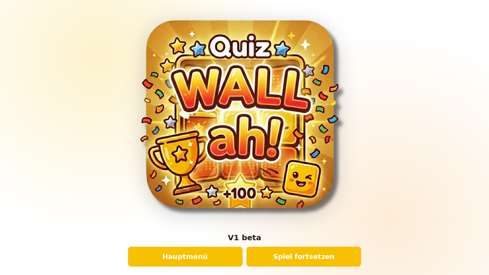

# Quiz Wall

Interaktive Jeopardy-Quiz-App (Vanilla HTML/CSS/JavaScript) mit Editor, Spielstandverwaltung, KI-Import-Workflow und starkem Mobile-/Tablet-Fokus.

Aktueller UI-Stand: Version aus `Versioninfo.txt` (wird in Splash und Hauptmenue angezeigt).

## Highlights

- Single-Page-App ohne Build-Tool, komplett clientseitig
- Trennung von Quiz (`.quiz.json`) und Spielstand (`.game.json`)
- Team-Setup vor Spielstart (2-4 Teams)
- In-App-Editor fuer Kategorien/Fragen inkl. globaler Punktestufenpflege
- Gefuehrter Frage-/Antwort-Flow mit Ranking-Update
- Manuelle Punktekorrektur pro Team (`Punkte anpassen`)
- CI-Einstellungen (Name, Logo, Farben, Farbsets)
- KI-Import mit Prompt-Generator und robustem JSON-Import
- PWA-Basis (Manifest, Service Worker, Icons)


## Schnellstart
Im Hauptmenue 
1. `🎯 Demo-Quiz laden`
2. `🎮 Neues Spiel` waehlen.

## Startscreen (Splash)

- Beim Start erscheint ein Splash-Screen mit grossem App-Icon.
- Icon-Groesse ist dynamisch:
  - Hochformat: ca. `80%` der Fensterbreite
  - Querformat: ca. `80%` der Fensterhoehe
- Der "Ladebalken" laeuft etwa `3` Sekunden.
- Danach wird der Ladebalken ausgeblendet und es erscheinen Splash-Aktionen:
  - `Hauptmenue`
  - `Spiel fortsetzen` (nur sichtbar, wenn ein Spielstand geladen ist)
- `Spiel fortsetzen` fuehrt direkt zur Quiz-Wall (wie im Hauptmenue).

### Screenshots

nur MIT geladenem Spielstand ist der Button `Spiel fortsetzen` sichtbar:



## Bedienung

### Hauptmenue

- Kopfbereich als zentrierte Gruppe: grosses Logo links, zwei Textzeilen rechts (linksbuedig).
- Untertitel wird dynamisch aufgebaut: `by Sigi Schulz` + Inhalt aus `Versioninfo.txt` (einzeilig angehaengt).

#### Hauptaktionen

- `🎮 Neues Spiel`
- `▶️ Spiel fortsetzen`

#### Quiz verwalten

- `🆕 Quiz neu erstellen`
- `✏️ Editor oeffnen`
- `⬇️ Quiz speichern`
- `📂 Quiz laden`
- `🎯 Demo-Quiz laden`
- `🤖 KI-Quiz importieren`

#### Spiel verwalten

- `💾 Spielstand speichern`
- `📂 Spielstand laden`
- `🔄 Spielstand zuruecksetzen`

#### Weitere Bereiche

- `⚙️ Einstellungen`
- `❓ Hilfe & Anleitung`

### Spielablauf

1. Frage auf der Quiz-Wall antippen.
2. Frage-Modal lesen, dann `Weiter`.
3. Antwort-Modal: korrekte Teams markieren oder Punkte manuell korrigieren.
4. Ranking wird aktualisiert.

#### Punkte manuell korrigieren

Im Ranking kann pro Team mit `✏️` die Karte `Punkte anpassen` geoeffnet werden:

- Modus `Gutschrift` / `Abzug`
- Punkte-Chips mehrfach nutzbar (aufsummierend)
- `Zuruecksetzen`, `Anwenden`, `Abbrechen`

### Editor

- Quiz-Titel pflegen
- Kategorien anlegen/bearbeiten/entfernen
- Fragen und Antworten pro Kategorie bearbeiten
- Globale Punktestufen:
  - einzelne Stufe bearbeiten
  - `+ Stufe` / `- Stufe`
  - `Zuruecksetzen` auf Jeopardy-Standard (100-500) mit Warnhinweis

## Einstellungen (CI)

- Name und Logo
- Farben 1-4 und Hintergrund
- Kacheltext-Modus (hell/dunkel)
- Farbset laden/speichern/zuruecksetzen
- Uebernahme per `Anwenden`, Verwerfen per `Abbrechen`

## KI-Import

- Prompt-basierter Workflow fuer externe KI
- Import von JSON oder JSON-Codeblock
- Strukturvalidierung + Normalisierung
- Hinweisdialog bei potentiell destruktiven Ueberschreibungen
- Reproduzierbarer LaTeX-Regressionsdatensatz in `latex-regression-quiz.json`

## Mobile/Responsive Verhalten

- Optimierte Layouts fuer Hoch-/Querformat
- Quiz-Wall auf kleinen Touchgeraeten scrollbar, damit Browserleisten ausblendbar sind
- Mobile Floating-Buttons auf der Quiz-Wall:
  - `🏆` Ranking
  - `🏠` Hauptmenue
- Modals fuer Frage/Antwort/Ranking/Score-Adjust mit Safe-Viewport-Regeln

## PWA

- `manifest.webmanifest`
- Service Worker (`sw.js`) mit:
  - HTML `network-first`
  - Assets `stale-while-revalidate`
- Icons in `icons/` (`192`, `512`, `apple-touch-icon`)

## Dateiformate

### Quiz-Datei (`.quiz.json`)

```json
{
  "version": "1.0",
  "type": "quiz",
  "timestamp": "2026-04-18T12:00:00.000Z",
  "quizTitle": "Mein Quiz",
  "categories": [
    {
      "id": 0,
      "name": "Kategorie 1",
      "questions": [
        {
          "id": "q-0-0",
          "points": 100,
          "question": "Frage?",
          "answer": "Antwort"
        }
      ]
    }
  ]
}
```

### Spielstand-Datei (`.game.json`)

```json
{
  "game": {
    "teams": [{ "id": 0, "name": "Team 1", "score": 200 }],
    "categories": [
      {
        "id": 0,
        "name": "Kategorie 1",
        "questions": [
          {
            "id": "q-0-0",
            "points": 100,
            "question": "Frage?",
            "answer": "Antwort"
          }
        ]
      }
    ]
  },
  "played": ["q-0-0"],
  "quizTitle": "Mein Quiz"
}
```

### Farbset-Datei (`.colorset.json`)

Enthaelt Theme-Farben und optional Branding-Daten (Name/Logo).

## Persistenz

Die App speichert lokal im Browser (`localStorage`), u. a.:

- Spielzustand inkl. Teams, Kategorien, gespielte Fragen
- Theme-/Branding-Einstellungen

## Projektstruktur

```text
/
├── index.html
├── style.css
├── script.js
├── default-quiz-data.js
├── sample-quiz.json
├── latex-regression-quiz.json
├── manifest.webmanifest
├── sw.js
├── icons/
│   ├── icon-192.png
│   ├── icon-512.png
│   └── apple-touch-icon.png
├── QUICKSTART.md
└── README.md
```

## Entwicklung / Deployment

- Keine Build-Pipeline noetig
- Lokales Hosting per `python3 -m http.server 8000` empfohlen
- Deployment z. B. via GitHub Pages moeglich

## Hinweise

- Rein clientseitig, kein Backend erforderlich
- Bei ungewoehnlichem Verhalten nach Updates: Seite 1-2x neu laden (Service-Worker-Cache)
- Fuer LaTeX-/MathJax-Sonderfaelle kann `latex-regression-quiz.json` direkt importiert werden.
- KI-Daten werden nicht automatisch direkt aus der App an KI-Dienste gesendet; Prompt/Antwort laufen manuell

## Lizenz

Im Repository ist aktuell keine separate Lizenzdatei hinterlegt.

## Changelog

### Version 2026.05.15 (V1 beta 12)
- LaTeX-Import robuster normalisiert, auch bei uneinheitlichen KI-Antworten ohne durchgaengige `$...$`-Delimiter.
- Mobile/desktop-unabhaengige Reparatur fuer chemische Formeln, Inline-Mathe und problematische Alt-Daten aus gespeicherten Quizstaenden verbessert.
- Textuelle LaTeX-Diakritika wie `\v{c}` und `\'{c}` werden beim Import fuer Namen im Textkontext sauber in Unicode ueberfuehrt.
- Regressionstest-Datei `latex-regression-quiz.json` fuer MathJax-/LaTeX-Sonderfaelle hinzugefuegt.
- Cache-Versionen fuer Web-Assets und Service Worker aktualisiert, damit neue Import- und Rendering-Logik sicher ausgerollt wird.

### Version 2026.05.05 (V1 beta 10)
- Stabiler KI-Import mit automatischer Reparatur.
- Reparatur beschädigter LaTeX-Sequenzen beim Import und Laden von Quizdateien.
- Durchgängige horizontale Zentrierung der Weiter-Schaltflächen auf Modal-Ebene, auch im Querformat.

### Version 2026.04.24 (V1 beta 3)

- MathJax/LaTeX-Rendering für mathematische und chemische Formeln in Fragen und Antworten vollständig integriert (inkl. dynamischer Modals, $...$-Syntax und \ce{...} für Chemie).
- MathJax-Konfiguration für Dollarzeichen-Syntax und mhchem-Paket (chemische Notation) ergänzt und korrekt geladen.
- Prompt für externen KI-Export klar mit LaTeX-/MathJax-/mhchem-Hinweis versehen (inkl. Beispielen für Summenformeln und Reaktionsschemata).
- Dynamisches Nach-Rendern von Formeln nach Modalerstellung robust umgesetzt.
- Bugfix: Chemische Formeln werden jetzt zuverlässig als solche erkannt und gerendert.
- Team-Setup-UI: Chips, Abstand und Layout für die Auswahl der Teamanzahl verbessert.
- Diverse kleinere UI/UX-Optimierungen und Bugfixes.

### Version 2026.04.20

- Splash-Screen-Ablauf angepasst:
  - Ladezeit von 5s auf 3s reduziert
  - nach Ablauf Umschaltung von Ladebalken auf Buttons
- Splash-Icon responsive auf 80% je nach Orientierung skaliert.
- Splash-Buttons zentriert ausgerichtet; im Querformat als mittige Gruppe nebeneinander.
- `Spiel fortsetzen` auf Splash nur bei vorhandenem Spielstand sichtbar; bei Spielstand direkter Sprung zur Quiz-Wall.
- Hauptmenue-Brandblock ueberarbeitet:
  - grosses Icon links neben Titel+Untertitel
  - Titel/Untertitel linksbuendig
  - gesamte Gruppe horizontal zentriert
- Hauptmenue-Untertitel auf `by Sigi Schulz` umgestellt und um den Inhalt aus `Versioninfo.txt` erweitert.

### Version 2026.04.19

- README komplett auf den aktuellen Stand gebracht (Version 0.9d, Features, Bedienung, Mobile, PWA).
- Hilfe & Anleitung auf Akkordeon-Layout umgestellt und Inhalte aktualisiert.
- Hilfetext zu Einstellungen inhaltlich angepasst (Animation-Hinweis, Speichern/Laden/Zuruecksetzen).
- Symbol-Hinweise in der Hilfe ergaenzt (u. a. Punkte anpassen `✏️`, Ranking `🏆`, Hauptmenue `🏠`).
- Mobile Scroll-Verhalten in mehreren Bereichen verbessert:
  - Hauptmenue auf kleinen Geraeten
  - Settings-Screen
  - Quiz-Wall (Portrait/Scroll-Puffer)
  - Frage-/Antwort-/Ranking-/Punkte-anpassen-Karten